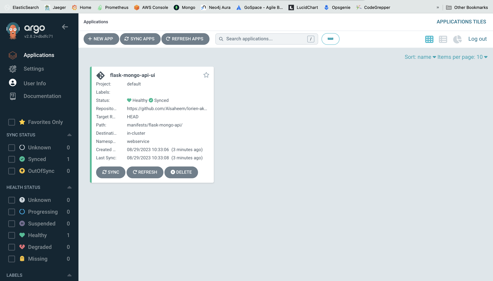
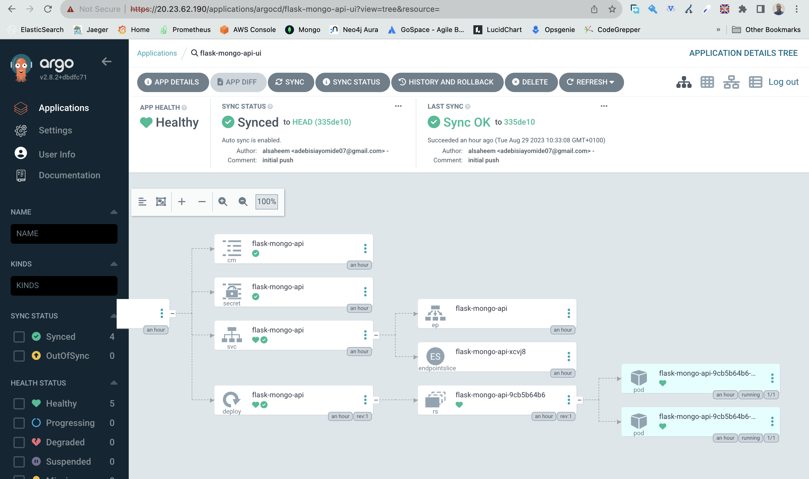
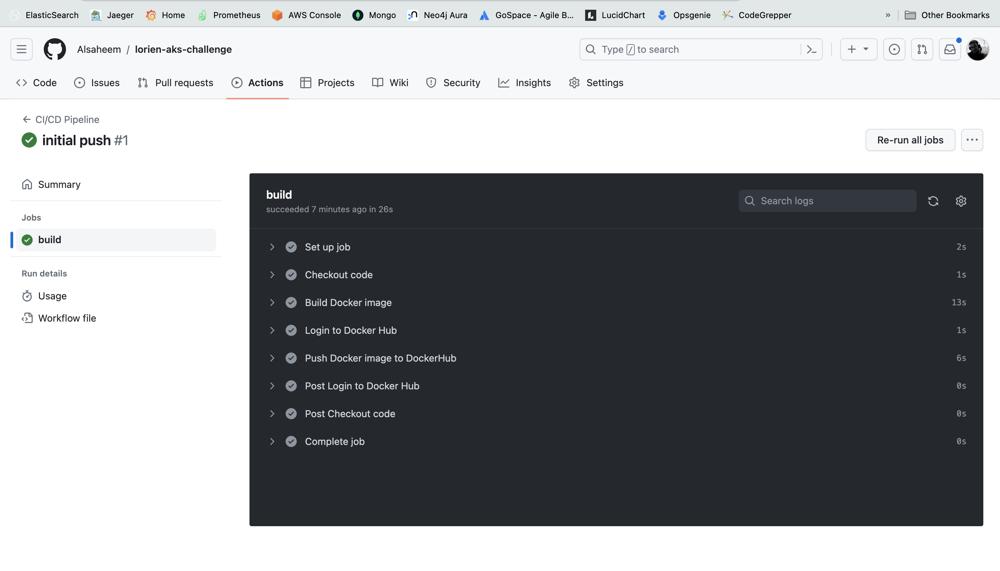
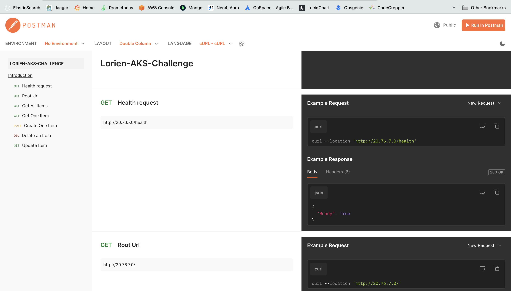
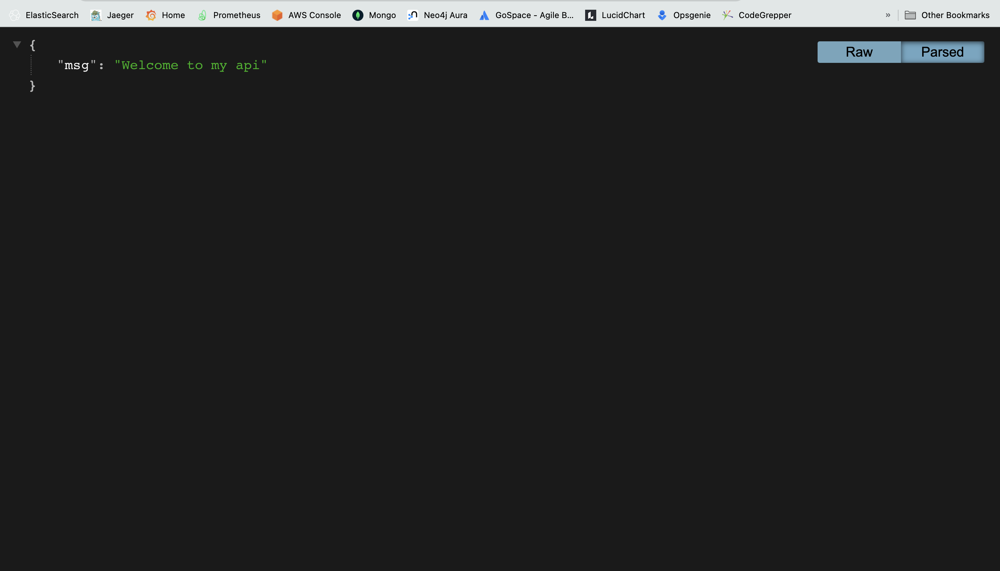
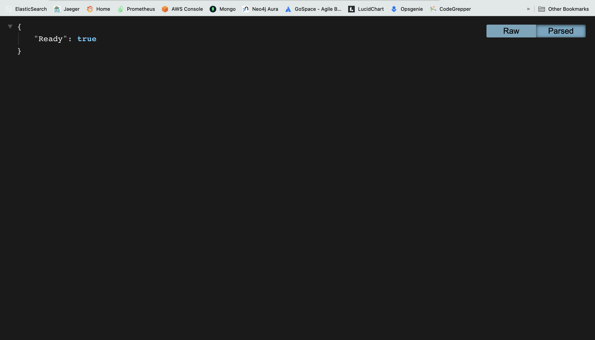

## Lorien AKS Challenge

Write a CRUD API in any language of your choice.  - Done
Create a docker image of the API. - Done
Create terraform for AKS and CI-CD pipeline to deploy the API using GitHub Actions - Done
Test the that you can reach the API from internet. - Done

### API Structure
The url of the API is http://20.76.7.0/ (please note that this is a HTTP url , not https)

The API was deployed on kubernetes runing on Azure (AKS)

Here are some sample requests to interact with the API

##### GET All Items:
```
curl -X GET http://20.76.7.0/items
```

##### GET One Item:
```
curl -X GET http://20.76.7.0/items/1
```

##### Create One Item:
```
curl -X POST \
  -H "Content-Type: application/json" \
  -d '{"name": "New Item", "description": "A new item description"}' \
  http://20.76.7.0/items
```

##### Update One Item:
```
curl -X PUT \
  -H "Content-Type: application/json" \
  -d '{"name": "Updated Item", "description": "Updated item description"}' \
  http://20.76.7.0/items/1
```

##### Delete One Item:
```
curl -X DELETE http://20.76.7.0/items/1
```
### Gitops
For GitOps , i used ArgoCD . 

The `setup.sh` was used to setup argocd and create the required namespaces locally

Argo CD is a Kubernetes controller, responsible for continuously monitoring all running applications and comparing their live state to the desired state specified in the Git repository.

The Argocd Server  can be reached here https://20.23.62.190/applications (please note that this is on Https)

- Argocd Server : https://20.23.62.190/applications
- Argocd Username : admin
- Argocd Password : V7lBR4nxMYMrEC6Q



Argocd Deployed the manifests referenced in the github repository



### Terraform Infrastructure - Deployment to Azure

The infrastructure was created using terraform and used to deploy the resources to Azure

The terraform state backend was stored on a azure storage account in order to keep track of the current state of the infrastructure

Terrraform was used to create the following resources on Azure

- A dedicated Resource group for the deployment 
- An Azure Container Registry for storing the images
- Azure Kubernetes Service (AKS) for deploying the kubernetes services.
- The Providers used were properly versioned and kept in constraint
- The variables needed for the infrastructure was given in a terraform.tfvars filr

### CiCd - Continuous integration and deployment

Continous integration and deploymet was done using github actions . When a push or merge request is made to the main branch , the pipeline triggers and packages the new version of the code to dockerhub

Dockerhub was used as the container registry for this application.

The docker registry can be reached via the link below 

https://hub.docker.com/repository/docker/alsaheem/flask-mongo-api/general


- CiCd pipeline can be seen here https://github.com/Alsaheem/lorien-aks-challenge/actions



### API Documentation on Postman
Documentation on how to ru the API was added on Postman

https://documenter.getpostman.com/view/8590260/2s9Y5Zvh1C




### Sample API Screenshots
Screenshots of the Home page and Health page of the API




#### TODO (other things i would have done)
- Setup Ingress with nginx
- Setup Image updater with ArgoCD (for automatically pulling images)
- Store docker images on ACR
- Connect a domain for this
